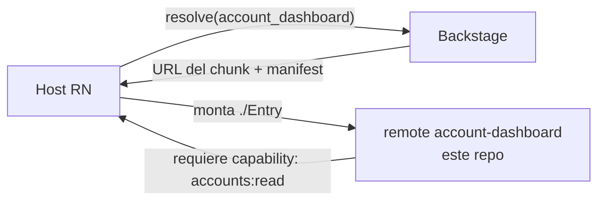

# miniapp-account-dashboard

> Una **miniapp** de ejemplo — un **remote federado de Re.Pack** que el host de React Native monta bajo demanda. Muestra el saldo de la cuenta y las transacciones recientes. Construida con el patrón de [miniapp-template](https://github.com/DentVega/miniapp-template) y distribuida a través de [Backstage](https://github.com/DentVega/backstage-web).

**🌐 English:** [README.md](./README.md) · **Demo de la plataforma:** [backstage-web-blond.vercel.app](https://backstage-web-blond.vercel.app)

---

## Dónde encaja



El host resuelve esta miniapp, descarga su chunk federado y monta `./Entry`, inyectando la **capability acotada `accounts:read`** — nunca credenciales crudas.

## Qué contiene

```
manifest.json           id: account_dashboard · shared: react, react-native, react-query, flash-list · capability: accounts:read
src/Entry.tsx           Entry de federación — guard de capability → renderiza el dashboard
src/Dashboard.tsx       Composición de la pantalla
src/components/         AccountHeader · SectionHeader · TransactionRow
src/domain/             Lógica pura: money (multi-moneda: EUR/USD/MXN, céntimos), transactions, types — testeado
src/data/               useAccountData (hook de datos)
.github/workflows/      CI: buildea el chunk federado + publica a Backstage
```

## Destacados

- 🧮 **Dominio puro y testeado** — manejo de dinero multi-moneda (EUR/USD/MXN con céntimos) y lógica de transacciones, testeados de forma independiente de la UI.
- 🔐 **Protegida por capability** — declara `accounts:read`; el host la concede acotada y revocable.
- 📜 **Guiada por contrato** — la forma de `Entry` y las deps compartidas vienen de `@org/miniapp-contract`.
- ⚡ **FlashList** para la lista de transacciones.

## Desarrollo

```bash
pnpm install
pnpm start        # dev server del remote en :9000
pnpm test         # tests de dominio + Entry
```

## Repos relacionados

| Repo | Rol |
|---|---|
| [backstage-web](https://github.com/DentVega/backstage-web) | Plano de control web — registro, scaffolder, distribución *(demo en vivo)* |
| [backstagereactnative](https://github.com/DentVega/backstagereactnative) | Host React Native + Re.Pack que monta esta miniapp |
| [miniapp-template](https://github.com/DentVega/miniapp-template) | La plantilla que sigue esta miniapp |

---

<sub>Parte de un demo/portfolio que muestra micro-frontends con Module Federation para React Native. No es un producto bancario de producción.</sub>
