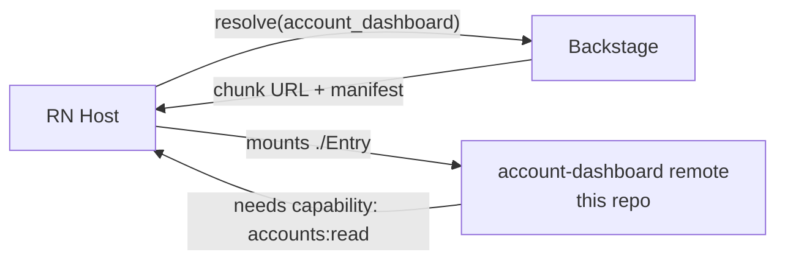

# miniapp-account-dashboard

> An example **miniapp** — a **Re.Pack federated remote** the React Native host mounts on demand. Shows account balance and recent transactions. Built from the [miniapp-template](https://github.com/DentVega/miniapp-template) pattern and distributed through [Backstage](https://github.com/DentVega/backstage-web).

**🌐 Español:** [README.es.md](./README.es.md) · **Platform demo:** [backstage-web-blond.vercel.app](https://backstage-web-blond.vercel.app)

---

## Where it fits



The host resolves this miniapp, downloads its federated chunk, and mounts `./Entry`, injecting the **scoped `accounts:read` capability** — never raw credentials.

## What's inside

```
manifest.json           id: account_dashboard · shared: react, react-native, react-query, flash-list · capability: accounts:read
src/Entry.tsx           Federation entry — capability guard → renders the dashboard
src/Dashboard.tsx       Screen composition
src/components/         AccountHeader · SectionHeader · TransactionRow
src/domain/             Pure logic: money (multi-currency: EUR/USD/MXN, cents), transactions, types — unit-tested
src/data/               useAccountData (data hook)
.github/workflows/      CI: build the federated chunk + publish to Backstage
```

## Highlights

- 🧮 **Pure, tested domain** — multi-currency money handling (EUR/USD/MXN with cents) and transaction logic, fully unit-tested independent of UI.
- 🔐 **Capability-gated** — declares `accounts:read`; the host grants it scoped and revocably.
- 📜 **Contract-driven** — the `Entry` shape and shared-deps come from `@org/miniapp-contract`.
- ⚡ **FlashList** for the transactions list.

## Develop

```bash
pnpm install
pnpm start        # remote dev server on :9000
pnpm test         # domain + Entry tests
```

## Related repos

| Repo | Role |
|---|---|
| [backstage-web](https://github.com/DentVega/backstage-web) | Web control plane — registry, scaffolder, distribution *(live demo)* |
| [backstagereactnative](https://github.com/DentVega/backstagereactnative) | React Native + Re.Pack host that mounts this miniapp |
| [miniapp-template](https://github.com/DentVega/miniapp-template) | The template this miniapp follows |

---

<sub>Part of a portfolio/demo showcasing Module Federation micro-frontends for React Native. Not a production banking product.</sub>
